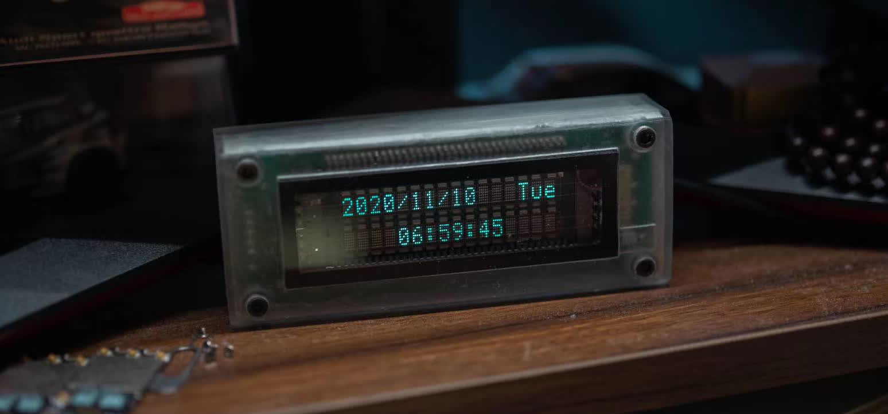

# VFD WiFi Clock

## Hardware:
- MCU: TTGO-T-Display ESP32
- DISPLAY: Futaba VFD162S 16x2
## Feature:
- NTP Time
- Outside Temperature Display
## Requirements:
- Futaba VFD162S library: https://github.com/Andy4495/FutabaVFD162S
- Arduino Json
- WiFiUdp
- NTPClient
- HTTPClient
- OpenWeatherMap API Key
- Your NMEA Coordinate
- Your WiFi Credentials